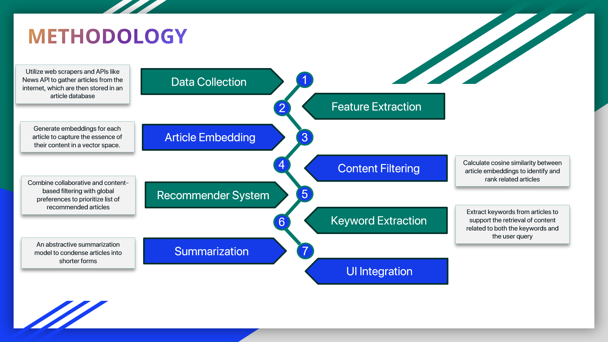
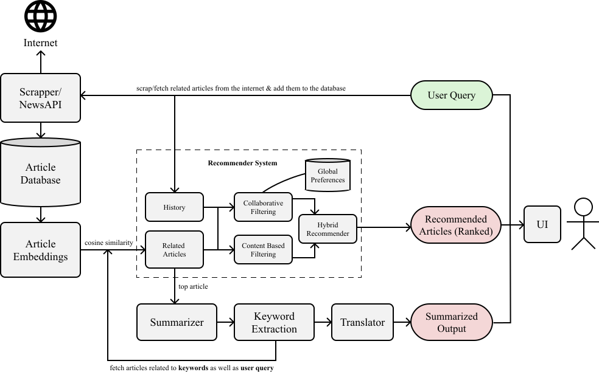
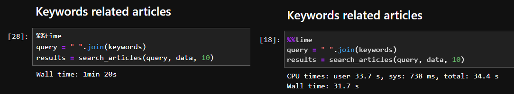

# Global Article Summarization and Link Analysis using Intel oneAPI

## Problem Statement
In today's fast-paced world, there is an overwhelming number of articles and updates that impact our
lives. However, finding the most important articles and understanding them can be quite challenging.
Even when you find the articles, extracting meaningful insights can be difficult.
The challenge is to develop an interactive platform that leverages advanced language processing
techniques to filter articles based on user inputs (E.g., Articles on Virat Kohli in IPL 2023, Interim Budget
Details for 2024, etc.) and provide concise, relevant summaries.

## Proposed Solution


## Architecture Diagram


## Intel OneAPI Integration
The project was initially prototyped locally, running on my AMD Ryzen 5 CPU and Nvidia GeForce GTX 1650 GPU for computation. However, since scikit-learn doesn't offer support for GPUs I wasn't efficiently utilizing my hardware for performance. 

The project was then ported to Intel oneAPI Cloud Platform, and I was able to gain ridiculous performance gains. The platform also makes onboarding easy with ready-made python kernels that comes with all the necessary modules preinstalled. 

Here's an example of computation time for cosine similarity using scikit-learn. On the left, we can see the local performance, and on the right, performance of Intel oneAPI Cloud. We can observe a significant performance boost of **252.4%** on this specific task. 



This performance gap is even more significant in more computationally demanding tasks and tasks involving the GPU.


### How is this performance gain possible?
It is because oneAPI allows efficient utilization of CPUs, GPUs and any heterogenous architectures, thus offering a faster, superior development and deployment process. The python modules in the kernel are modified to make use of oneAPI to run as efficiently as possible on their cloud infrastructure hardware. 

To get started with using the Intel extension for Scikit-learn one just has to include the following code before import:

```python
from sklearnex import patch_sklearn
patch_sklearn()
```

## Future Work
- Implement the web crawler to source the articles
- Optimize query retrieval through indexing and caching techniques
- Build the hybrid recommender system to sort the related articles
- Implement the translation pipeline
- Make the summarization length configurable 


## Video Demo
[](https://www.youtube.com/watch?v=suqpWYhphFE)
